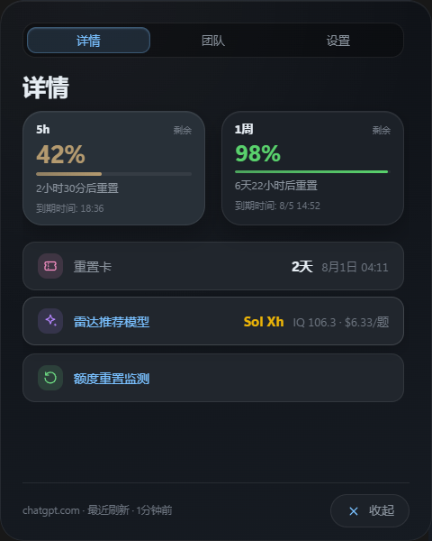
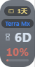

# CodexStatus · 桌面额度监控

[English](#english) | [中文](#中文)

---

<h1 id="中文">CodexStatus</h1>

**Codex 额度桌面悬浮监控，实时掌握剩余配额。**

[](https://github.com/libing93920/CodexStatus/releases)
[](https://github.com/libing93920/CodexStatus/releases)
[](LICENSE)

[下载最新版](https://github.com/libing93920/CodexStatus/releases/latest) · [使用说明](#快速开始) · [问题反馈](https://github.com/libing93920/CodexStatus/issues)

### 效果预览

| 详情面板 | 水平胶囊 | 迷你球 |
|---|---|---|
|  |  |  |

## 为什么需要这个工具？

在日常使用 Codex 的过程中，经常会遇到以下痛点：

- 打开网页才能看剩余额度，频繁切换窗口打断工作流
- 不知道 5 小时和 7 天的额度分别剩多少，什么时候重置
- 很多模型可选，但不知道哪个性价比最高
- 团队成员之间看不到彼此的剩余额度，无法协调使用

CodexStatus 可以帮你：

- 桌面胶囊常驻显示额度，一眼可见，无需切换窗口
- 同时监控 5h 和 7d 两个窗口，各有独立的百分比、进度条和重置倒计时
- 雷达推荐模型：按 IQ 阈值筛选，自动选"够聪明 + 最便宜"的那个
- 局域网团队排行：同事相互可见剩余额度，方便协调

## 核心功能

- **双窗口额度卡片**：5h 和 7d 分别展示百分比、进度条、重置倒计时和到期时间
- **胶囊常驻悬浮**：水平胶囊 / 迷你球两种形态，可吸附屏幕边缘，支持拖拽
- **团队排行榜**：局域网内同事互见，按剩余额度降序排名，展示 5h + 7d 双行数据
- **雷达推荐模型**：从 codex-reset-radar 拉取 IQ 评分，按阈值筛选后取最实惠的
- **在线自动更新**：启动自动检查 + 定时检查，胶囊右上角红点提醒，一键下载静默安装
- **双口径切换**：剩余百分比 / 已使用百分比，满足不同习惯
- **官方接口优先**：读取 ChatGPT 官方额度，不可用时自动回退到本地 sessions

## 下载

前往 [Releases](https://github.com/libing93920/CodexStatus/releases) 下载最新版本。

| 平台 | 文件 |
| --- | --- |
| Windows | `CodexStatus-{version}-setup.exe` |

> macOS / Linux 暂未提供预编译包，可从源码构建。

## 快速开始

1. 下载 `CodexStatus-*-setup.exe` 并安装
2. 启动后胶囊窗口自动出现在桌面右上角
3. 需要读取官方额度时，确保 `~/.codex/auth.json` 存在且含有效 access_token
4. 点击胶囊打开详情面板，查看完整额度和推荐模型
5. 在设置页配置刷新间隔、百分比口径、IQ 阈值等偏好

## 使用说明

### 胶囊窗口

- **左列**：5h 重置倒计时（无 5h 时显示 7d）
- **中间**：当前额度百分比 + 进度条（颜色从绿色渐变到红色）
- **右列**：重置卡到期倒计时 + 雷达推荐模型名称

右键胶囊或托盘图标可唤出菜单：刷新 / 显示隐藏 / 详情 / 团队 / 设置 / 退出。

### 详情面板

- **详情**：5h + 7d 双卡片，重置卡信息，雷达推荐模型，额度重置监测入口
- **团队**：加入相同口令的同事排行榜，每行显示 5h + 1周双窗口数据
- **设置**：刷新模式 / 间隔 / 百分比口径 / IQ 阈值 / 开机自启 / 语言 / 团队口令 / 检查更新

### 团队功能

1. 设置相同的团队口令
2. 同一局域网内自动发现成员
3. 排行榜显示每位成员的 5h 和 1周剩余额度

> 注意：全局代理 / TUN 模式会劫持内网多播，导致互不可见。

## 数据来源

| 数据 | 来源 | 备注 |
| --- | --- | --- |
| 官方额度 | `chatgpt.com` API | 需要有效 OAuth 凭据 |
| 重置卡 | `chatgpt.com` API | |
| 雷达模型 | `codex-reset-radar.pages.dev` | 公开数据 |
| 团队数据 | 局域网 mDNS + WebSocket | 内网直连 |

官方接口不可用时自动回退到本地 sessions JSONL 文件。

## 技术栈

- Electron 39 + electron-vite
- React 19 + TypeScript 5
- electron-updater（在线更新）
- bonjour-service（mDNS 局域网发现）
- ws（WebSocket peer 通信）

## 本地开发

```bash
npm install            # 安装依赖
npm run dev            # 启动开发
npm run lint           # 代码检查
npm run typecheck      # 类型检查
```

## 构建

```bash
# Windows（国内镜像加速）
ELECTRON_MIRROR="https://npmmirror.com/mirrors/electron/" \
ELECTRON_BUILDER_BINARIES_MIRROR="https://npmmirror.com/mirrors/electron-builder-binaries/" \
npm run build:win

# 一键发布
python scripts/publish.py              # 升版本号 + 打包 + 发布
python scripts/publish.py --no-bump    # 用当前版本号打包发布
python scripts/publish.py --notes "说明"  # 自定义 Release 备注
```

## License

[MIT](LICENSE)

---

如果这个工具对你有帮助，请点一个 ⭐ Star，帮助更多人发现它。

---

<h1 id="english">CodexStatus</h1>

**Desktop Codex quota monitor. Always-on capsule showing your remaining usage at a glance.**

[](https://github.com/libing93920/CodexStatus/releases)
[](https://github.com/libing93920/CodexStatus/releases)
[](LICENSE)

[Download](https://github.com/libing93920/CodexStatus/releases/latest) · [Getting Started](#getting-started) · [Issues](https://github.com/libing93920/CodexStatus/issues)

### Preview

| Panel | Horizontal Capsule | Orb |
|---|---|---|
|  |  |  |

## Why CodexStatus?

When using Codex daily, you often face:

- Need to open a browser just to check your remaining quota — constant context switching
- Can't see 5h vs. 7d quota separately, or when each resets
- Too many model options, not sure which gives the best value
- Can't see team members' quota usage to coordinate

CodexStatus helps you:

- Desktop capsule always on top — quota visible at a glance
- Dual-window display (5h + 7d), each with percentage, progress bar, and reset countdown
- Radar model picker: filters by IQ threshold, picks the cheapest qualified model
- LAN team leaderboard: see teammates' usage side by side

## Key Features

- **Dual-window quota cards**: 5h and 7d each with percentage, progress bar, countdown, and expiry time
- **Always-on capsule**: Horizontal capsule or orb mode, snap-to-edge, draggable
- **Team leaderboard**: LAN peer discovery, ranked by remaining quota, dual-row 5h + 7d display
- **Radar model recommendation**: IQ scores from codex-reset-radar, filtered by threshold, cheapest wins
- **Auto-update**: Startup check + periodic check, red dot badge on capsule, silent install & auto-restart
- **Dual metric mode**: Remaining % or Used %, switch anytime
- **Official API priority**: Fetches from ChatGPT official API, falls back to local sessions

## Download

Go to [Releases](https://github.com/libing93920/CodexStatus/releases) for the latest version.

| Platform | File |
| --- | --- |
| Windows | `CodexStatus-{version}-setup.exe` |

> macOS / Linux builds not yet provided. Build from source.

## Getting Started

1. Download and install `CodexStatus-*-setup.exe`
2. The capsule appears at the top-right of your desktop on launch
3. For official quota, make sure `~/.codex/auth.json` contains a valid access_token
4. Click the capsule to open the panel for full details
5. Configure refresh interval, metric mode, IQ threshold, etc. in Settings

## Data Sources

| Data | Source | Notes |
| --- | --- | --- |
| Official quota | `chatgpt.com` API | Requires valid OAuth credentials |
| Reset credits | `chatgpt.com` API | |
| Radar models | `codex-reset-radar.pages.dev` | Public data |
| Team data | LAN mDNS + WebSocket | Local network only |

## Tech Stack

- Electron 39 + electron-vite
- React 19 + TypeScript 5
- electron-updater
- bonjour-service (mDNS)
- ws (WebSocket)

## Development

```bash
npm install
npm run dev
npm run lint
npm run typecheck
```

## Build

```bash
# Windows (with China mirror)
ELECTRON_MIRROR="https://npmmirror.com/mirrors/electron/" \
ELECTRON_BUILDER_BINARIES_MIRROR="https://npmmirror.com/mirrors/electron-builder-binaries/" \
npm run build:win

# One-click publish
python scripts/publish.py              # bump + build + publish
python scripts/publish.py --no-bump    # build + publish only
python scripts/publish.py --notes "..."  # with custom release notes
```

## License

[MIT](LICENSE)

---

If you find this tool useful, please give it a ⭐ Star. It helps more people discover it.
